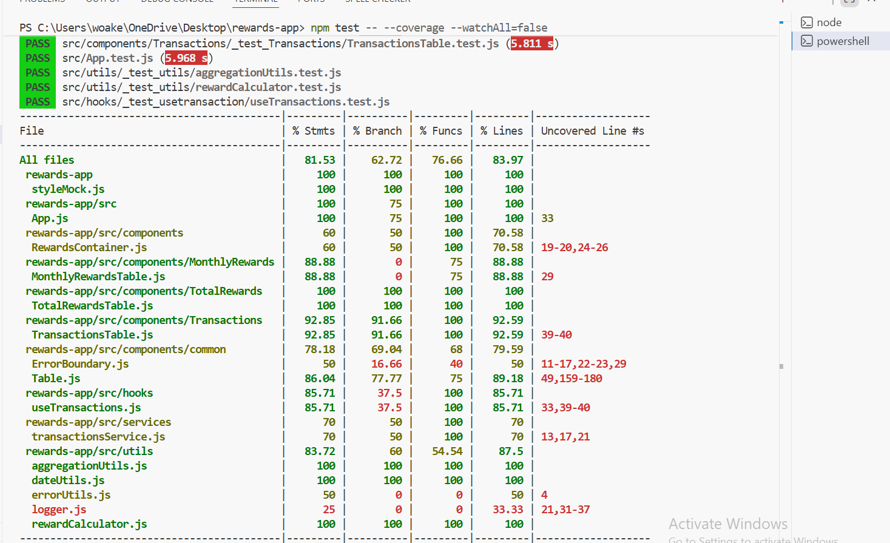
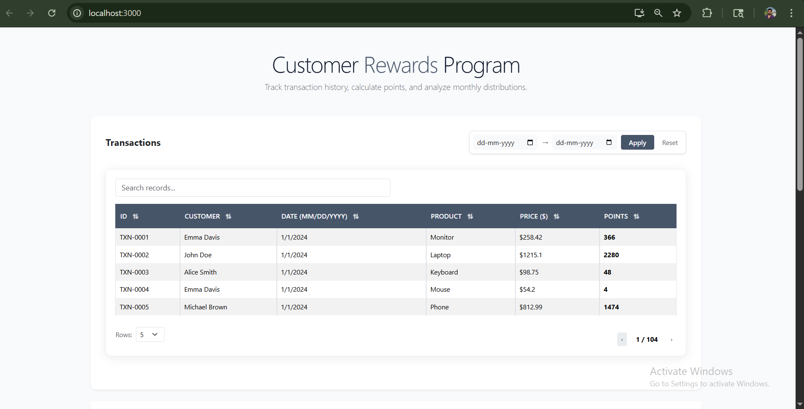
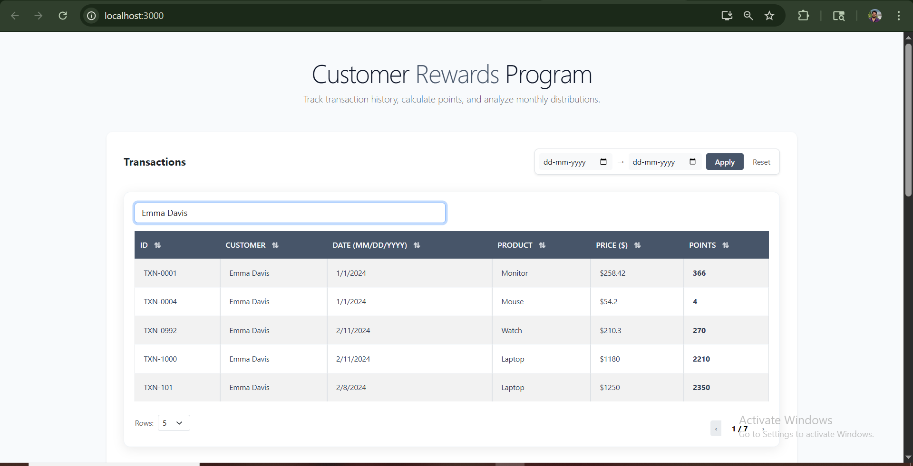
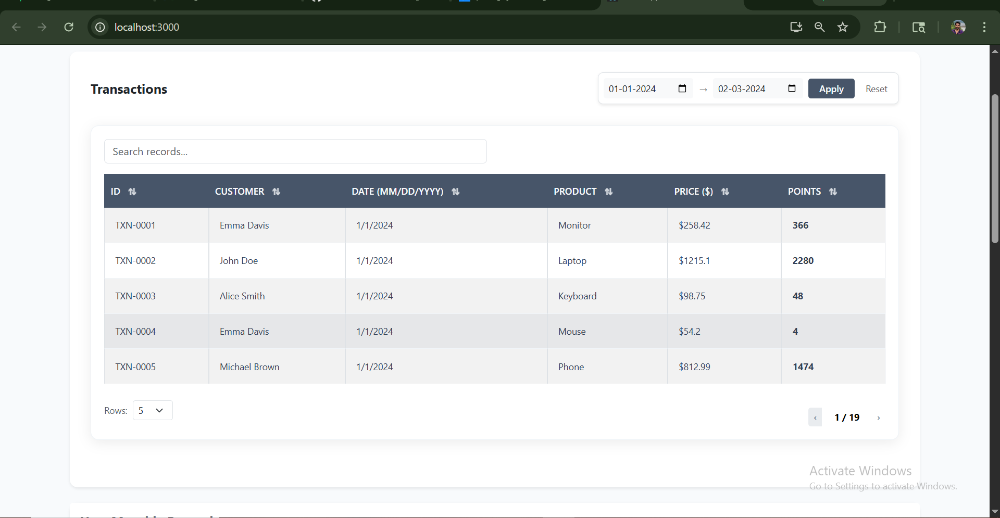
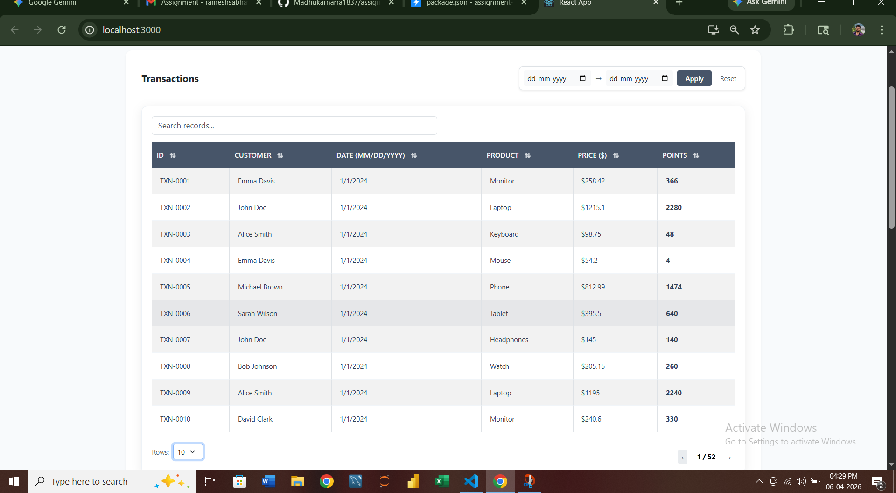
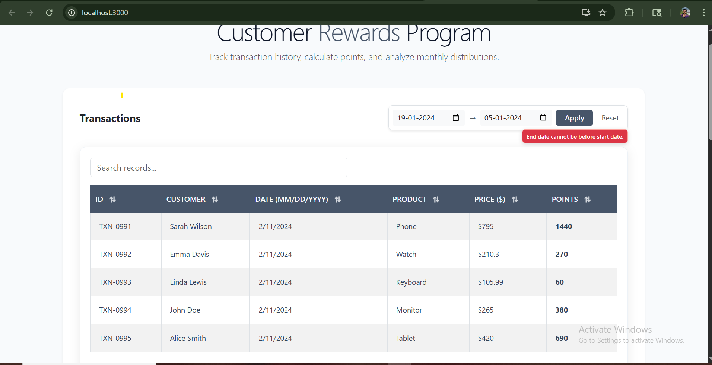
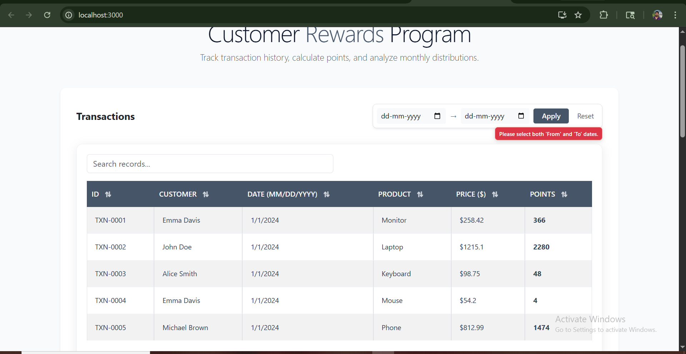
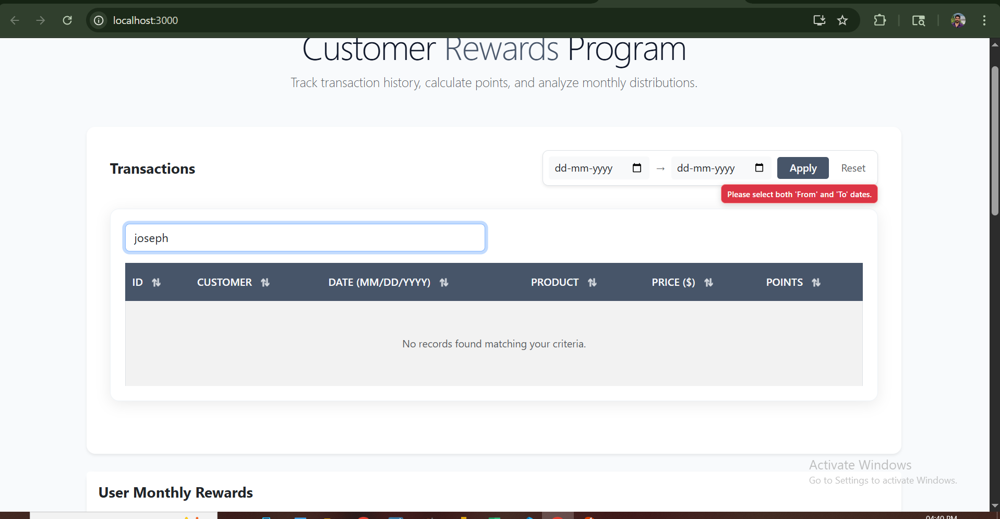
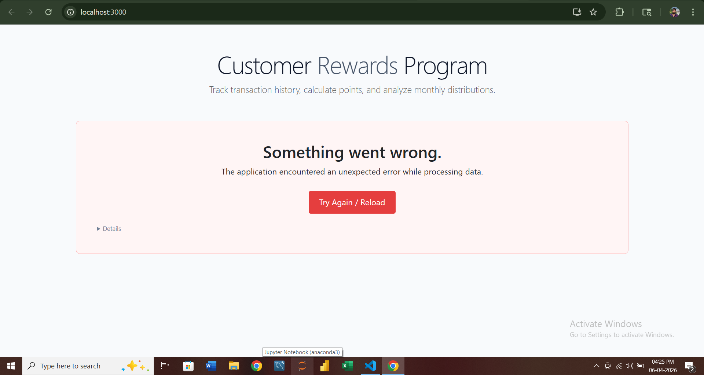

# Customer Rewards Program

## Overview
This application calculates and displays reward points earned by customers based on their transaction history. It supports transaction-level rewards, monthly aggregation, and total rewards using reusable UI Components.

REWARDS-APPLICATION/
├── node_modules/
├── public/
└── src/
├── components/
│   ├── common/
│   │   ├── __tests__/
│   │   │   └── TableComponent_test.js
│   │   ├── ErrorBoundary.js
│   │   ├── ErrorMessage.js
│   │   ├── Table.css
│   │   └── TableComponent.js
│   ├── MonthlyRewards/
│   │   ├── MonthlyRewardsTable.js
│   │  
│   ├── TotalRewards/
│   │   ├── TotalRewardsTable.js
│   │  
│   ├── Transactions/
│   │   ├── __tests__/
│   │   │   └── TransactionsTable_test.js
│   │   ├── TransactionsTable.js
│   │   └── TransactionsTable.css
│   └── RewardsContainer.js
├── hooks/
│   ├── __tests__/
│   │   └── Transactions_test.js
│   └── useTransactions.js
├── services/
│   └── transactionsService.js
├── utils/
│   ├── __tests__/
│   │   ├── aggregationUtils_test.js
│   │   └── rewardCalculator_test.js
│   ├── aggregationUtils.js
│   ├── dateUtils.js
│   ├── errorUtils.js
│   ├── logger.js
│   └── rewardCalculator.js
├── App.css
├── App.js
├── index.css
└── index.js

## Reward Rules
- < $50:  0 points
- $50-$100: 1 points per dollar over $50
- > $100: 2 points per dollar over $100
- Decimal values are floored

## Data Assumptions
In the provided dataset, customerName represents the logical customer identity.
Although customerId is present, multiple IDs may correspond to the same name.
Aggregation is therefore performed based on the logical customer identity.

## Application Architecture
- Data is fetched from a mock API endpoint
- State an side-effects are managed via a custom hook
- Business logic id handled using pure utility functions
- UI rendering is done via reusable table components

## UI Features
- Transactions table with reward calculation
- Monthly rewards aggregation (month+year)
- Total rewards per customer
- Sorting, filtering, and pagination

## Error Handling & Logging
Errors are centrally logged using a logger utility and surfaced to the UI using
a consistent error state model. Errors are never silently swallowed.

## Testing
Tests focus on business logic correctness and UI rendering behavior, including aggregation, date handling, and table interactions

## Running the Application
npm install
npm start

Run tests:
npm test

# All assets are located in the `src/assets` directory.

## Test Coverage Report
The screenshot below confirms that all 6 test suites passed and core logic files (like `rewardCalculator.js`) maintain high coverage.

## Core UI Features
These screenshots demonstrate the main functionality of the Rewards Dashboard.

### 1. Dashboard Overview
The primary interface displaying calculated rewards and transaction history.

### 2. Search & Filtering
Global Search Real-time filtering by customer names.
  
Date Range Filter Specifically filters transactions between two user-defined dates.
  

### 3. Pagination Controls
Dynamic Row Selection: Users can change the "Rows Per Page" setting (5, 10, 20).
  

## Validation & Edge Cases
The application is designed to handle user errors and empty data states gracefully.

### 1. Date Logic Validation
Prevents logical errors where a user might select an end date that occurs before a start date.

### 2. Missing Input Handling
Prompts the user when required date selections are missing.

### 3. Empty Data States
Provides clear feedback when no records match the current filter criteria.

### Error Handling
The application includes an Error Boundary to catch unexpected issues gracefully.
